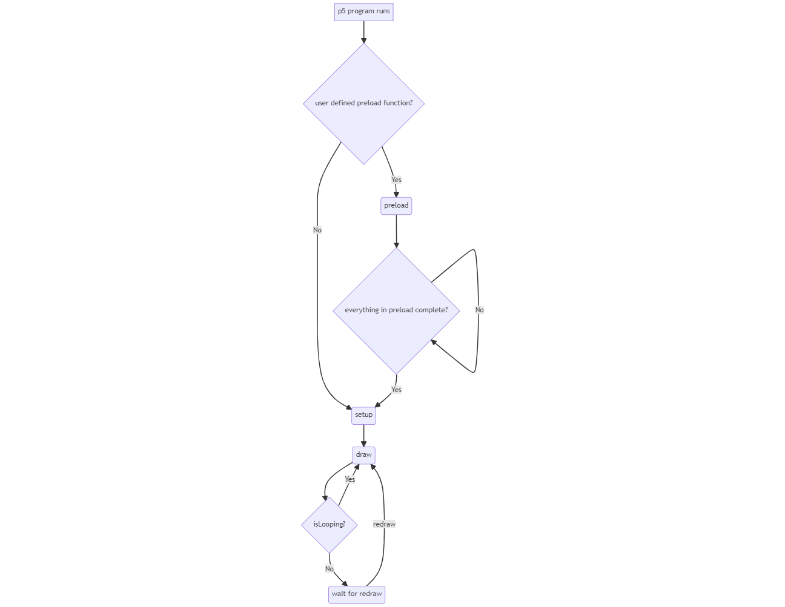

# Loading Data

Fortunately, p5 provides a couple of mechanisms to make it easy to use several types of files, including `csv` files. There are a few problems when working with files, including data files (like `csv`s). 

The prime problem is that it takes time to bring the information from the file into the program. In terms of language architecture, a long process like loading a file can either block the execution of your program until it is loaded (which will make it look like the program is taking a long time to load), or load the data _asyncronously_ while taking percuations to not use the data before its loaded. We can actually make use of either technique with p5, but for now we will stick with the first option, which will have the effect of our program taking a little longer to get started. We will achieve this through the [`preload`](https://p5js.org/reference/#/p5/preload) function.

Below is a flow chart of what happens when you "hit play" on a p5 program. The key new piece of information here is that if a `preload` function is defined, then everything in that function must be complete before we even move on to setup. This is a perfect place to load large pieces of information into our programs. 



Another problem is actually reading the information in to the program and then interpreting it once it comes in. p5 gives us a storage facility called [`p5.Table`](https://p5js.org/reference/#/p5.Table), the accompanying [`p5.TableRow`](https://p5js.org/reference/#/p5.TableRow), and a function to easily load `csv` data into a table called [`loadTable`](https://p5js.org/reference/#/loadTable).

Let's take a look at how all of this works. 

## `preload` and `loadTable`

```javascript
let table;
//...
function preload() {
  table = loadTable("data/metro-grades.csv", "csv", "header");
}
```

Pretty exciting. 

The `loadTable` function takes as a first parameter the data file we are trying to load. In this case, the file is in a folder called `data`. The second parameter is telling `loadTable` that we are dealing with a `csv` file. The final parameter says that this file has a header row.[^1] Once the program starts, `setup` won't run until the the table is loaded into the `table` variable.[^2] 

## `p5.Table`

What is actually loaded is a complicated structure called a `p5.Table`. The p5 reference has a list of all the magical things we can do with the table now that we have access to it. It is certainly worth the time to [read the documentation](https://p5js.org/reference/#/p5.Table), but we will also be hitting some of the highlights during this lab. 

<!--Footer-->
[^1]: It should be noted that sometimes `loadTable` is a little finicky. For instance, for this file, I had to delete the final, empty line of the file in order for the function to execute properly. Cleaning data is a big part of working with data. 
[^2]: As always, there's nothing magical about the variable being named `table` here. We could as easily call it `justine` or `lemonPop`, but it does make _sense_ to call it `table` since it is, in fact, a table. 