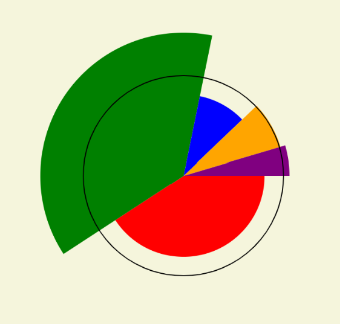

# The Right Ingredients for the Pie (Chart)

We made function that can create a pie chart at any location with any radius and with any data stored in an array. The problem now becomes, how do we give the right data to the pie chart function.

All we really need to do right now is to put the right data into an array. In this case, we are going to get the data from the `p5.TableRow` we used to display the text information. `const row = table.getRow(currentRowIndex);` One easy way to do this would be to construct the array using the same mechanism we used before: `row.get(some column name)`. Since we are just interested in the population values, it would look something like this:

```javascript
const pieChartData = [
  row.get('white_pop'),
  row.get('black_pop'),
  row.get('hisp_pop'),
  row.get('asian_pop'),
  row.get('other_pop')
]
```

If you update the code to use this array, you will see that nothing has happened and, worst of all, there are no error messages. The problem is this data is stored as _strings_ in the `csv`, not numbers. Here is an example line again:

`"Philadelphia...",C,"104259","179683","79519","16407","15719","395587",...`

We need an easy way to convert these to numbers. Both JavaScript and p5 provide ways to do this. You could use JavaScript's `parseInt` function or p5's `int` function here.[^1]

```javascript
const pieChartData = [
  int(row.get('white_pop')),
  int(row.get('black_pop')),
  int(row.get('hisp_pop')),
  int(row.get('asian_pop')),
  int(row.get('other_pop'))
]
```

## Challenges

1. Add a label and key so that we can easily understand what we are looking at. You could add this information to the pie chart function or display it seperately.
2. Just a different "group" of data from `row` and create an additional pie chart on the screen, complete with its own label and a different key, as needed.
3. **Honors** The columns that start with `lq_` contain data called "Location Quotients," which are measures of over- or under-representation for a population in a given area. Use this data to create a pie chart that conveys the over- or under-representation along with the proportion. Something that looks like this:



<!--Footnotes-->
[^1]: It should be noted that we are using integer-based functions because that's the type of number we are dealing with. If we had non-integer numberse we would `parseFloat` or `float`[^2] respectively
[^2]: `float` is short for "floating-point number", which is how computers refer to non-integer numbers. 
